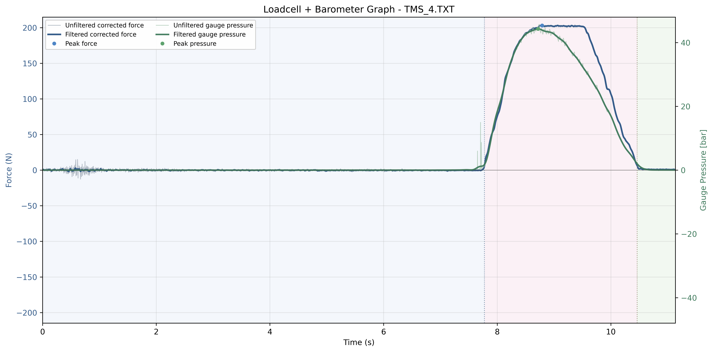
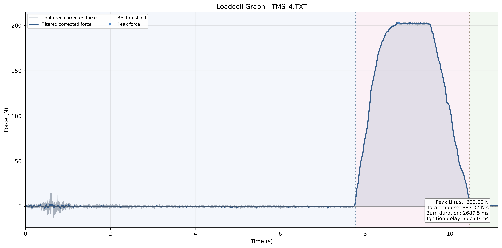
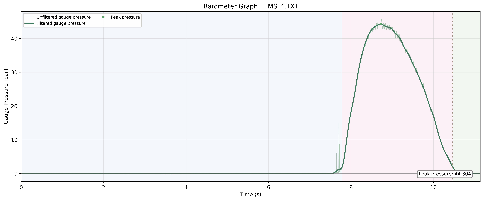

# 4월 8일 연소 실험

## Graphs

### Combined Plot

### Loadcell Plot

### Barometer Plot

## Metrics

| 항목 | 값 |
|---|---|
| 입력 파일 | TMS\Data\2026\4_8\TMS_4.TXT |
| 샘플링 속도 | 320 sps |
| 점화 지연 | 7775.0 ms |
| 연소 시간 | 2687.5 ms |
| 최대 추력 | 203.00 N |
| 평균 추력 | 144.03 N |
| 총 임펄스 | 387.07 N s |
| 최대 압력 | 44.304 bar at 8.719 s |

## 시험 조건 및 데이터 처리

| 항목 | 값 |
|---|---|
| 드리프트 보정 | Constant baseline offset |
| 로드셀 임계값 (3%) | 6.09 N |
| 추력 필터 | Butterworth low-pass 20.0 Hz, order 2 |
| 압력 필터 | Butterworth low-pass 5.0 Hz, order 4 |
| 압력 기준 오프셋 | -0.099480 bar |
| 로드셀 기준 오프셋 | -2.366372 N |
| 로드셀 기준 구간 | 0.000000 to 3.887500 s (1244 samples, pre-ignition raw force) |
| 압력 기준 구간 | first 0.500 s (160 samples, filtered pressure) |

## Calibration

| 항목 | 값 |
|---|---|
| 로드셀 보정 기울기 | -0.039100 kg/ADC |
| 로드셀 보정 절편 | -193.0049 kg |
| 로드셀 보정 R^2 | 0.999948 |
| 압력 변환식 | y = 0.0027x -0.11 |

## Issues

- 특이사항 기록 없음.

## Test Video

- 공개된 영상 링크 없음.

## Result Files

- [Executive Report](./files/TMS_4_executive_report.txt)
- [Pipeline Data](./files/TMS_4_pipeline_data.txt)
