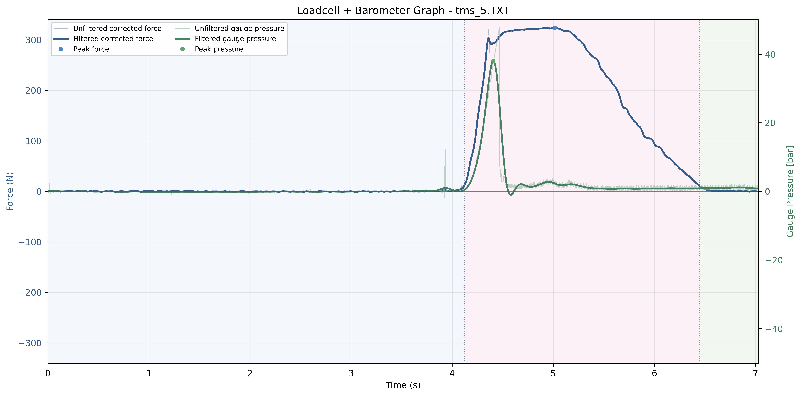
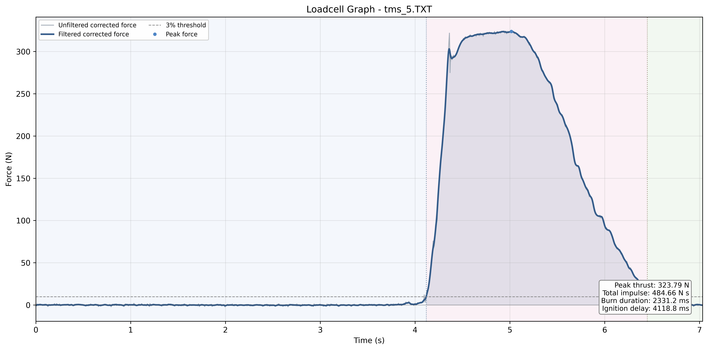
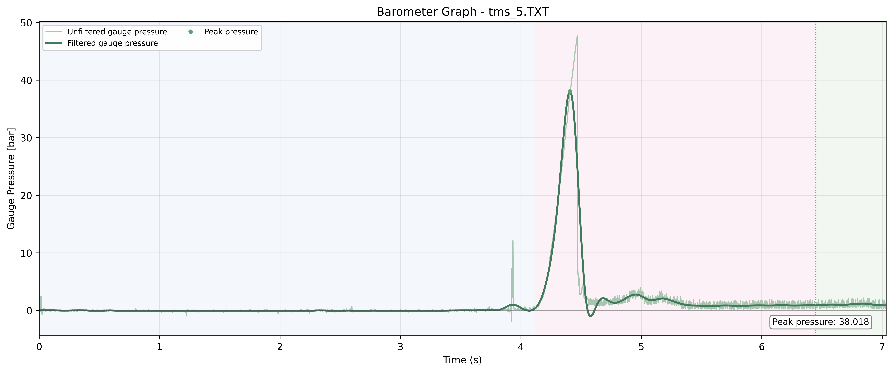

# 7월 16일 연소 시험

## Reference Figures

### Combined Plot

### Loadcell Plot

### Barometer Plot

## Metrics

| 항목 | 값 |
|---|---|
| 입력 파일 | TMS\Data\2026\7_16\TMS_5.TXT |
| 샘플링 속도 | 320 sps |
| 점화 지연 | 4118.8 ms |
| 연소 시간 | 2331.2 ms |
| 최대 추력 | 323.79 N |
| 평균 추력 | 207.90 N |
| 총 임펄스 | 484.66 N s |
| 최대 압력 | 38.018 bar at 4.406 s |

## 시험 조건 및 데이터 처리

| 항목 | 값 |
|---|---|
| 드리프트 보정 | Constant baseline offset |
| 로드셀 임계값 (3%) | 9.71 N |
| 추력 필터 | Butterworth low-pass 20.0 Hz, order 2 |
| 압력 필터 | Butterworth low-pass 5.0 Hz, order 4 |
| 압력 기준 오프셋 | 2.343215 bar |
| 로드셀 기준 오프셋 | -12.834497 N |
| 로드셀 기준 구간 | 0.000000 to 2.059375 s (659 samples, pre-ignition raw force) |
| 압력 기준 구간 | first 0.500 s (160 samples, filtered pressure) |

## Calibration

| 항목 | 값 |
|---|---|
| 로드셀 보정 기울기 | -0.039100 kg/ADC |
| 로드셀 보정 절편 | -193.0049 kg |
| 로드셀 보정 R^2 | 0.999948 |
| 압력 변환식 | y = 0.0027x -0.11 |

## Issues

- 압력 채널: 최대 압력(38.018 bar, 4.406 s) 직후 raw 값이 1개 샘플(3.125 ms) 만에 47.7→7.6 bar로 급락. 연소 종료(6.45 s) 이후 baseline로 복귀하지 않고 8~14초 구간에서 26.9 bar까지 재상승(같은 구간 로드셀은 0 N 부근).
- 로드셀 채널: rise time 194 ms로 이전 시험(597–634 ms) 대비 짧음.
- 상세: [Raw 데이터 기록](./files/raw_data_notes.md)

## Test Video

- 공개된 영상 링크 없음.

## Result Files

- [Executive Report](./files/tms_5_executive_report.txt)
- [Pipeline Data](./files/tms_5_pipeline_data.txt)
